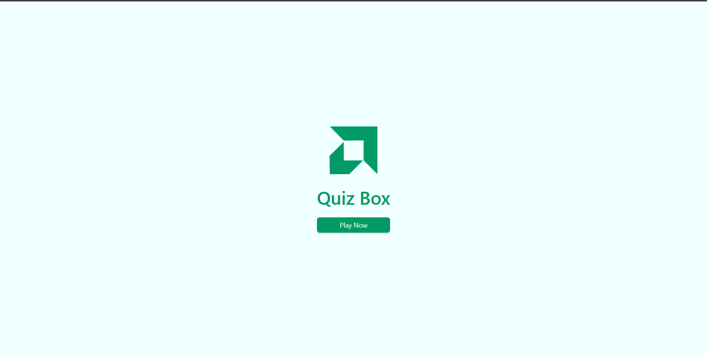
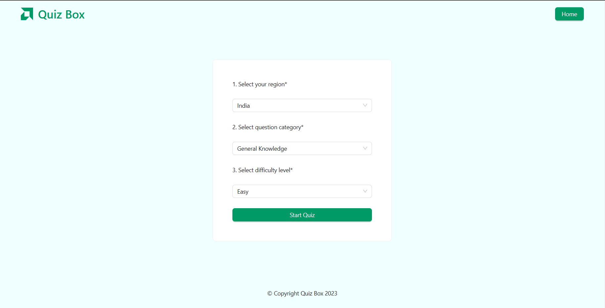
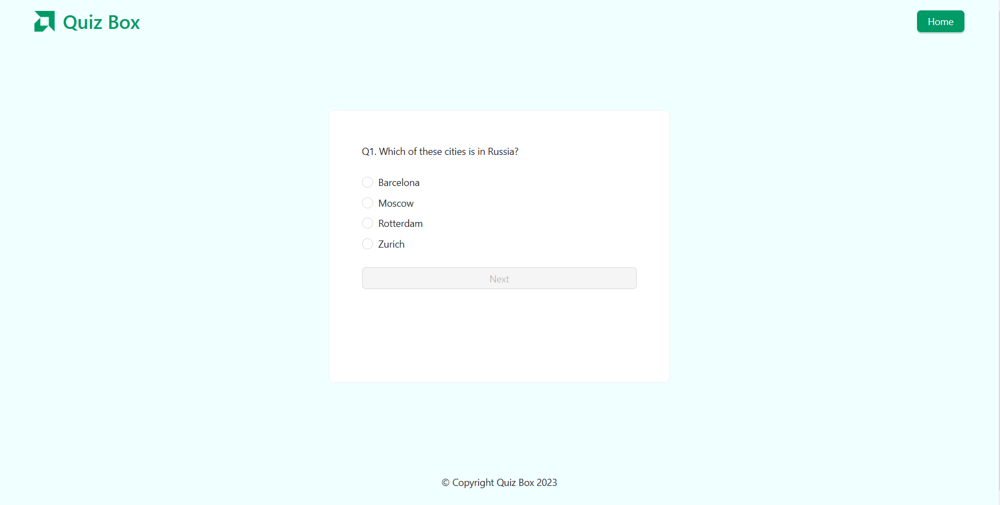
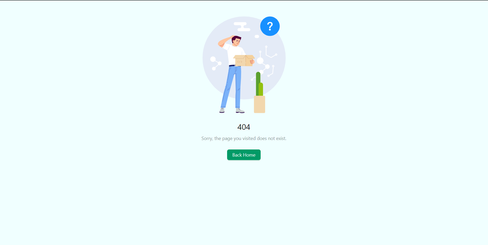

# NASE Client <h6>Project Documentation : Author - Puneet Karamchandani / jkaramchandani32@gmail.com</h6>

<a style="color:#009a66;font-size:28px;" href="">Quiz Box</a>

#### Steps to run the application

<ul>
<li>Step 1. - Clone the repo with to your local machine.
</li>
<li>Step 2. - Open terminal in the project root folder.</li>
<li>Step 3. - Run the command "yarn install".</li>
<li>Step 4. - To run in development server command - "yarn run dev".</li>
<li>Step 5. - To generate a production build command - "yarn build"</li>
</ul>

### Folder Structure

<ul>
    <li>1. actions - contains actions that dispatch state updates and api calls</li>
    <li>2. assets - contains project images and svgs</li>
    <li>3. components - contains reusable components for the project</li>
    <li>4. contains  - contains project constants</li>
    <li>5. layouts - contains project root layout</li>
    <li>6. pages - contains all the project pages</li>
    <li>7. providers - contains  routes and theme providers</li>
    <li>8. public - contains html and other public files</li>
    <li>9. redux - contains redux store setup along with reducers</li>
    <li>10. utils - contains helper functions like fetch API helper and other data APIs</li>
</ul>

#### Pages

<ul>
<li>Page 1. - Home Page</li>

<li>Page 2. - Start Quiz</li>

<li>Page 3. - Play Quiz</li>

<li>Page 4. - Page Not Found</li>

</ul>
